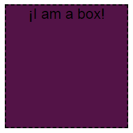

# RandomBox

### Descripción.-
Creamos una caja con REACT dotada de un color de relleno aleatorio y un texto con fuentes diversas. Al recargar la página se cambiarán los valores.

### Herramientas a utilizar.-
- REACT
- CSS3
- HTML5

### Ejemplo:

